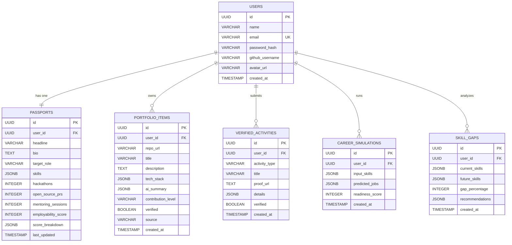

# AI Future Passport

> **The Living Employability Ecosystem for the AI Era (2025–2040).**  
> Not a static resume builder. Not a generic course platform. A dynamic, AI-verified system that measures, proves, and navigates a student's real-world readiness for an AI-dominated workforce.

[](https://ai-passport-ebon.vercel.app)
[](https://ai-passport-1.onrender.com)
[](https://build.nvidia.com)
[](https://neon.tech)
[](LICENSE)

---

## 📑 Table of Contents
1. [Core Idea & Vision](#-1-core-idea--vision)
2. [Why It Was Created (The Problem It Solves)](#-2-why-it-was-created-the-problem-it-solves)
3. [Competitive Comparison](#-3-competitive-comparison-why-we-are-different)
4. [Core Modules & Features](#-4-core-modules--features)
5. [How It Works (Under the Hood)](#-5-how-it-works-under-the-hood)
6. [Employability Scoring Formula](#-6-the-mathematical-employability-score-engine)
7. [Database Schema & Architecture (ERD)](#-7-database-schema--entity-relationships)
8. [API Endpoints Reference](#-8-api-endpoints-reference)
9. [Step-by-Step User Guide](#-9-step-by-step-user-guide)
10. [Local Development & Setup](#-10-local-development--setup)
11. [Security & Privacy](#-11-security-privacy--rate-limiting)
12. [Frequently Asked Questions (FAQ)](#-12-frequently-asked-questions-faq)
13. [Author & Acknowledgments](#-13-author--contact)

---

## 🌟 1. Core Idea & Vision

**AI Future Passport** solves the fundamental credibility crisis in tech hiring.

Traditional hiring relies on **unverified resumes** and static LinkedIn claims that suffer from keyword inflation and lack technical credibility. Meanwhile, students have no data-backed way of knowing whether the skills they learn today will remain relevant in the AI-accelerated job market.

### What AI Future Passport Does:
1. **Verifies Technical Truth**: Analyzes real GitHub code repositories, architectures, and language distributions using **Nvidia NIM (Llama 3.1 8B)** to eliminate fake claims.
2. **Computes a Live 100-Point Employability Score**: A transparent, multi-dimensional algorithm evaluating verified code complexity, polyglot versatility, hackathons, open source PRs, and community leadership.
3. **Simulates Career Trajectories (2025–2040)**: Uses predictive AI modeling to forecast emerging futuristic roles and student readiness scores.
4. **Performs 2030 Skill Gap Radar Analytics**: Compares a student’s current technical competencies against 2030 industry demand curves and recommends high-impact certifications.
5. **Issues a Verifiable Public Credential Sheet**: A public URL (`/public/passport/:username`) that recruiters can inspect with zero friction.

---

## 🎯 2. Why It Was Created (The Problem It Solves)

| The Problem in Modern Hiring | How AI Future Passport Solves It |
|---|---|
| **Resume Inflation & Keyword Stuffing** | **AI Code Verification**: Repositories are crawled and evaluated with Nvidia AI for architecture, code depth, and polyglot balance. |
| **Arbitrary Metric Steppers (Fake Proof)** | **Proof-Backed Credential System**: Hackathons require Devpost/Certificates; PRs require valid GitHub pull request links. |
| **Uncertainty About the AI Future (2025–2040)** | **Career Time Machine**: Forecasts how emerging AI technologies and software automation will transform job roles between 2025 and 2040. |
| **Blind Skill Acquisition** | **Skill Gap Radar**: Pinpoints exact missing competencies and assigns 2030 relevance scores (0–100). |
| **Disconnected Tooling & Fragmented Profiles** | **All-in-One Living Dashboard**: Syncs GitHub, tracks live employability score, and updates passport in real-time. |

---

## ⚔️ 3. Competitive Comparison: Why We Are Different

| Feature | Traditional PDF Resume | LinkedIn Profile | LeetCode / HackerRank | **AI Future Passport** |
|---|:---:|:---:|:---:|:---:|
| **Code-Level Verification** | ❌ None | ❌ None | ⚠️ Isolated Puzzles | ✅ **Full GitHub Architecture** |
| **Dynamic Employability Score** | ❌ None | ❌ None | ⚠️ Contest Rating | ✅ **100-Point Multi-Attribute** |
| **AI Predictive Career Simulation** | ❌ None | ❌ None | ❌ None | ✅ **2025–2040 Time Machine** |
| **2030 Skill Gap Analytics** | ❌ None | ❌ None | ❌ None | ✅ **AI Demand Curve Radar** |
| **Proof-Backed Hackathons & PRs** | ⚠️ Unverified Text | ⚠️ Unverified Text | ❌ None | ✅ **URL & Regex Validated** |
| **Shareable Public Sheet** | ❌ Static File | ⚠️ Gated Network | ❌ None | ✅ **Instant Public Verification** |

---

## 🚀 4. Core Modules & Features

```
┌────────────────────────────────────────────────────────────────────────┐
│                        AI FUTURE PASSPORT SUITE                        │
├───────────────────┬───────────────────┬────────────────────────────────┤
│ 🏆 Dashboard      │ ⏳ Career Time    │ 📡 Skill Gap Radar             │
│ Live Score Ring,  │ Machine           │ 2030 demand curve analysis,    │
│ verified activity │ AI forecasts for  │ relevance scores (0-100), and  │
│ credentials, &    │ 2025-2040 jobs    │ actionable certification       │
│ score breakdown.  │ & readiness index.│ intervention paths.            │
├───────────────────┼───────────────────┼────────────────────────────────┤
│ 📁 Portfolio      │ 👤 Profile        │ 🌐 Public Passport             │
│ AI code analyzer, │ Activity summary, │ Publicly shareable credential  │
│ complexity rating │ verified proof    │ sheet with direct proof links  │
│ & tech stacks.    │ credentials list. │ for tech recruiters.           │
└───────────────────┴───────────────────┴────────────────────────────────┘
```

### 1. Dashboard & Live Score Ring
- Visualizes the student's **Employability Score (0–100)** with a dynamic SVG circular gauge.
- Categorizes student readiness into **Expert (75–100)**, **Intermediate (50–74)**, and **Developing (0–49)** tiers.
- Displays the **Verified Activity Credentials Card** with categories for Hackathons, Open Source PRs, and Mentoring.
- Provides interactive `+ Add Verified Proof` modal and clickable `View Proof ↗` links.

### 2. Career Time Machine (2025–2040)
- Simulates how artificial intelligence, cloud architectures, and modern software engineering will reshape industry roles.
- Generates 4 tailored futuristic job roles (e.g. *Autonomous AI Agent Architect*, *AI Ethics & Governance Specialist*).
- Calculates a **Role Fit Score** and an overall **Career Readiness Index**.

### 3. Skill Gap Radar (2030 Workforce Analytics)
- Evaluates the student's skills on a 2030 relevance scale (0–100).
- Highlights critical missing competencies (e.g. *MLOps*, *Cloud Orchestration*, *AI Collaboration*).
- Prescribes prioritized, high-impact certification and project recommendations.

### 4. Portfolio Generator (AI Code Verification Engine)
- Crawls public GitHub repositories, extracts language distributions, and analyzes architectural depth.
- Assigns complexity ratings ($1\text{--}10$) and contribution levels (`high`, `medium`, `low`).
- Automatically filters out unverified duplicates so only verified projects appear.

### 5. Public Passport Sharing
- Shareable profile link (`https://ai-passport-ebon.vercel.app/public/passport/:username`).
- Enables recruiters to verify candidates in 5 seconds with live score breakdown and direct proof links.

---

## ⚙️ 5. How It Works (Under the Hood)

```
┌────────────────────────────────────────────────────────────────────────┐
│                        REACT 18 / VITE FRONTEND                        │
│   Dashboard (ScoreRing) · Portfolio · Time Machine · Skill Radar · Profile  │
└───────────────────────────────────┬────────────────────────────────────┘
                                    │ HTTP / REST API (JWT)
                                    ▼
┌────────────────────────────────────────────────────────────────────────┐
│                   PYTHON / FASTAPI BACKEND GATEWAY                     │
│  FastAPI Router · Auth Middleware · SlowAPI Rate Limiter · URL Rewriter │
└───────────┬───────────────────────┬──────────────────────┬─────────────┘
            │                       │                      │
            ▼                       ▼                      ▼
┌───────────────────────┐ ┌───────────────────┐ ┌────────────────────────┐
│   NEON POSTGRESQL     │ │    NVIDIA NIM     │ │     GITHUB REST v3     │
│ Connection Pool (SSL) │ │ Llama-3.1-8B-Ins  │ │ OAuth 2.0 Auth         │
│ users, passports,     │ │ Code Analysis     │ │ Repo Ingestion         │
│ portfolio_items,      │ │ Career Simulation │ │ Language Byte Parsing  │
│ verified_activities   │ │ 2030 Skill Radar  │ │ PR / Contributor Check │
└───────────────────────┘ └───────────────────┘ └────────────────────────┘
```

---

## 📊 6. The Mathematical Employability Score Engine

$$S_{\text{total}} = \min(S_{\text{projects}} + S_{\text{skills}} + S_{\text{hackathons}} + S_{\text{open\_source}} + S_{\text{mentoring}}, 100)$$

```
┌────────────────────────┬─────────────┬──────────────┬──────────────────────────────────────────────────────┐
│ Category               │ Max Points  │ Unit Value   │ Verification Method                                  │
├────────────────────────┼─────────────┼──────────────┼──────────────────────────────────────────────────────┤
│ AI-Verified Projects   │ 30 pts      │ +10 pts/repo │ Nvidia AI complexity rating (>= 5) & modular code.   │
│ Verified Skills        │ 20 pts      │ +2 pts/skill │ Extracted from codebase languages (noise filtered).  │
│ Verified Hackathons    │ 20 pts      │ +5 pts/event │ Devpost / Project submission / Certificate proof.    │
│ Open Source PRs        │ 15 pts      │ +5 pts/PR    │ Validated GitHub PR URL regex & merged commits.      │
│ Mentoring & Leadership │ 15 pts      │ +5 pts/sess  │ Documented community workshops & club leadership.    │
├────────────────────────┼─────────────┼──────────────┼──────────────────────────────────────────────────────┤
│ TOTAL EMPLOYABILITY    │ 100 pts     │ —            │ Deterministic, live database recalculation.          │
└────────────────────────┴─────────────┴──────────────┴──────────────────────────────────────────────────────┘
```

---

## 🗄️ 7. Database Schema & Entity Relationships



---

## 🔌 8. API Endpoints Reference

### Authentication (`/api/auth`)
- `POST /api/auth/register` — Register a new student account.
- `POST /api/auth/login` — Login with email/password (returns JWT).
- `GET /api/auth/me` — Fetch currently authenticated user session.
- `GET /api/auth/github` — Initiate GitHub OAuth 2.0 flow.
- `GET /api/auth/github/callback` — Handle GitHub OAuth callback & auto-sync repositories.

### Passport & Score (`/api/passport`, `/api/score`)
- `GET /api/passport/:user_id` — Fetch complete passport profile with live score.
- `PUT /api/passport/:user_id` — Update headline, bio, target role, and skills.
- `GET /api/score/:user_id` — Fetch detailed employability score breakdown.
- `POST /api/score/recalculate` — Trigger database score recalculation.

### Repositories & Portfolio (`/api/portfolio`, `/api/github`)
- `POST /api/portfolio/verify` — Manually submit and AI-verify a GitHub repository.
- `GET /api/portfolio/:user_id` — List all verified portfolio items.
- `DELETE /api/portfolio/:id` — Remove a portfolio item.
- `POST /api/github/sync` — Auto-sync all public GitHub repositories with on-the-fly AI verification.
- `GET /api/github/status` — Get repository sync status.

### Verified Activities (`/api/activities`)
- `GET /api/activities/:user_id` — List all proof-backed credentials.
- `POST /api/activities` — Submit a verified Hackathon, Open Source PR, or Mentoring proof.
- `DELETE /api/activities/:id` — Delete an activity and dynamically recalculate score.

### AI Intelligence (`/api/timemachine`, `/api/radar`, `/api/public`)
- `POST /api/timemachine/simulate` — Run Career Time Machine simulation (2025–2040).
- `POST /api/radar/analyse` — Run 2030 Skill Gap Radar analysis.
- `GET /api/public/passport/:username` — Public, unauthenticated student verification sheet.

---

## 📖 9. Step-by-Step User Guide

### 1. Sign In & GitHub Connection
1. Go to [https://ai-passport-ebon.vercel.app](https://ai-passport-ebon.vercel.app).
2. Click **"Sign in with GitHub"** to securely authenticate via OAuth 2.0.

### 2. Auto-Sync & AI-Verify Projects
1. Navigate to **Portfolio**.
2. Click **"Sync & Auto-Verify Repos"**.
3. Repositories are analyzed by Nvidia AI, assigned complexity ratings, and marked **AI-Verified**.

### 3. Add Verified Credentials
1. On **Dashboard**, locate the **Verified Activity Credentials** card.
2. Click **"+ Add Verified Proof"**.
3. Select **Hackathon** (add Devpost/Certificate URL), **Open Source PR** (add GitHub PR URL), or **Mentoring**.
4. Click **"Save & Recalculate Score"** — watch your score update instantly!

### 4. Run the Career Time Machine
1. Navigate to **Career Time Machine**.
2. Select your skills and interests → click **"Simulate Career Trajectory"**.
3. Review 4 futuristic job roles, emerging timelines, and your Career Readiness Index.

### 5. Analyze Skill Gaps
1. Go to **Skill Radar** → click **"Run 2030 Skill Gap Analysis"**.
2. View your skills' 2030 relevance scores (0–100) and prioritized certification recommendations.

### 6. Share with Recruiters
1. Click **"View public ↗"** to get your public profile link:  
   `https://ai-passport-ebon.vercel.app/public/passport/YOUR_USERNAME`
2. Share it on your resume, LinkedIn, or portfolio for verified credibility.

---

## 💻 10. Local Development & Setup

### Prerequisites
- Node.js 18+ & npm
- Python 3.10+
- PostgreSQL database (or free [Neon.tech](https://neon.tech) instance)
- Nvidia NIM API Key ([build.nvidia.com](https://build.nvidia.com))
- GitHub OAuth App Client ID & Secret

### 1. Clone Repository
```bash
git clone https://github.com/Manish7sgf/AI-Passport.git
cd AI-Passport
```

### 2. Backend Setup (FastAPI)
```bash
cd server_python
python -m venv venv
# Windows:
.\venv\Scripts\activate
# Linux/macOS:
source venv/bin/activate

pip install -r requirements.txt
cp .env.example .env
# Edit .env with your DATABASE_URL, JWT_SECRET, NVIDIA_API_KEY, GITHUB credentials

# Start FastAPI server:
uvicorn main:app --reload --port 5000
```

### 3. Frontend Setup (React/Vite)
```bash
cd ../client
npm install
cp .env.example .env
# Edit .env:
# VITE_API_BASE_URL=http://localhost:5000/api

# Start Vite dev server:
npm run dev
```

Visit: `http://localhost:5173` (Frontend) | `http://localhost:5000/api/docs` (Interactive Swagger API Docs)

---

## 🔒 11. Security, Privacy & Rate Limiting

- **JWT Authentication**: HMAC SHA-256 tokens with 7-day expiration verifying all protected state updates.
- **SlowAPI Rate Limiting**: Protection against brute force and DDoS on authentication, AI generation, and GitHub synchronization endpoints.
- **SQL Injection Defense**: All database interactions use parameterized queries via `psycopg2-binary`.
- **SSL / TLS Encryption**: Neon PostgreSQL connections enforce strict `sslmode=require` in production.
- **CORS & Middleware**: Strict origin filtering and URL rewrite middleware supporting both `/api/*` and direct route prefixes.

---

## ❓ 12. Frequently Asked Questions (FAQ)

<details>
<summary><strong>1. How is this different from a standard resume builder?</strong></summary>
Resume builders allow students to write unverified text. AI Future Passport inspects actual source code in GitHub repositories, validates language distributions, verifies pull requests, and computes a live, evidence-backed score.
</details>

<details>
<summary><strong>2. How does the AI prevent fake or empty repos from getting high scores?</strong></summary>
The AI evaluates repository size (>800 KB for top complexity), language diversity (full-stack polyglot), README documentation depth, and commit ownership. Empty scripts or cloned forks receive low complexity scores (1–4/10) and do not qualify for verified status.
</details>

<details>
<summary><strong>3. Can recruiters access my passport without creating an account?</strong></summary>
Yes! The Public Passport (`/public/passport/:username`) is unauthenticated and provides recruiters with an instant, verified candidate sheet with direct clickable proof links.
</details>

<details>
<summary><strong>4. Can I add private repositories?</strong></summary>
Yes. If you sign in with GitHub OAuth and grant repository permissions, the system can sync and verify your private repositories securely.
</details>

---

## 👤 13. Author & Contact

**Manish Varman**  
- **GitHub**: [@Manish7sgf](https://github.com/Manish7sgf)  
- **Live Production App**: [https://ai-passport-ebon.vercel.app](https://ai-passport-ebon.vercel.app)  
- **Backend API**: [https://ai-passport-1.onrender.com](https://ai-passport-1.onrender.com)  

---
*Built with ❤️ for student career empowerment in the AI generation.*
